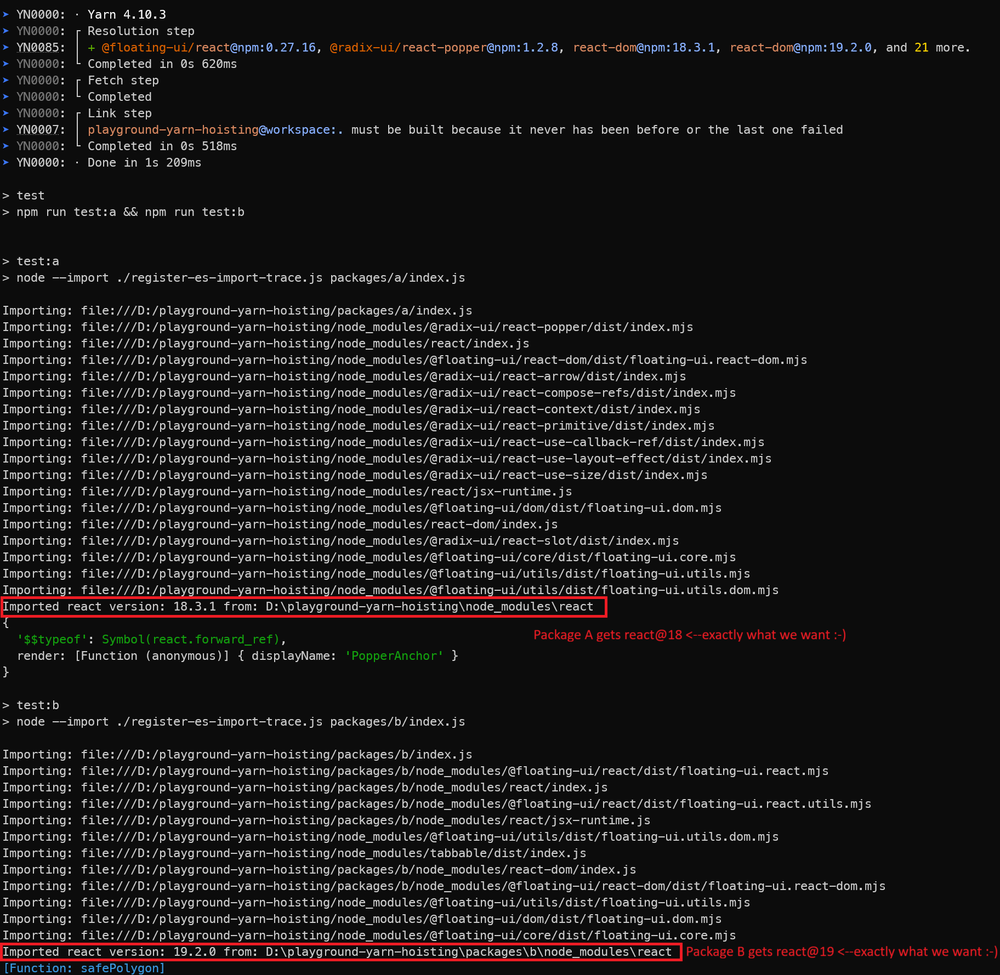

# playground-yarn-hoisting

This is a playground to permit experimentation with yarn's hoisting behavior when multiple packages depend on different major versions of the same dependency.

## Yarn v4 Fix Repro Steps

1. Install yarn globally with `npm install -g yarn`
2. Run `yarn retest:windows`. This will...
    - Clean the workspace by deleting all `node_modules` and `yarn lock`
    - Reinstall dependencies with `yarn install`
    - Run a script that will look for all installed versions of React, and add a console.log statement to the end of them that will enable you to see which ones get imported
    - Run tests for both packages A and B, which will show you which modules end up getting used, and where.

You can see that Package A correctly gets `react@18` and Package B gets `react@19`, as expected. Switch to the [main branch](https://github.com/astegmaier/playground-yarn-hoisting/) to see the original problem.

