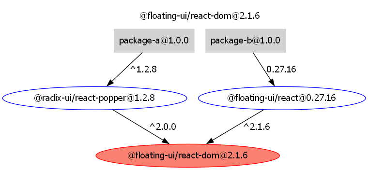

# playground-yarn-hoisting

This is a playground to permit experimentation with yarn's hoisting behavior when multiple packages depend on different major versions of the same dependency.

## What is this testing?

This is a simple monorepo set up with yarn workspaces, and a simple dependency graph:



`@floating-ui/react-dom` specifies these peer dependencies:

```json
  "peerDependencies": {
    "react": ">=16.8.0",
    "react-dom": ">=16.8.0"
  },
```

Package A directly depends on React 18, while Package B directly depends on React 19, so yarn should set things up in a way that respects both of these versions for both packages.

## Yarn v1 Bug Repro Steps

1. Install yarn globally with `npm install -g yarn`
2. Run `yarn retest:windows`. This will...
    - Clean the workspace by deleting all `node_modules` and `yarn lock`
    - Reinstall dependencies with `yarn install`
    - Run a script that will look for all installed versions of React, and add a console.log statement to the end of them that will enable you to see which ones get imported
    - Run tests for both packages A and B, which will show you which modules end up getting used, and where.

You can see the wonky results below. Switch to the [yarn-v4 branch](https://github.com/astegmaier/playground-yarn-hoisting/tree/yarn-v4) to see the fix.


